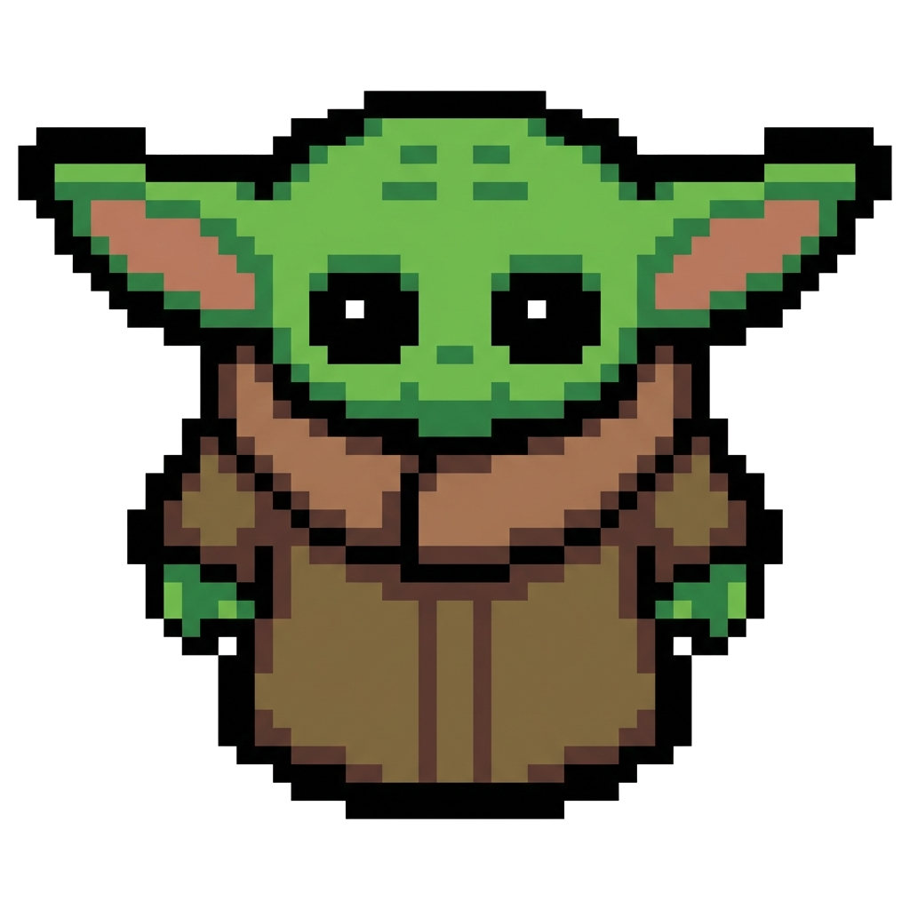

# 🌌 Grogu Crossing

A Mandalorian-themed Frogger-style game where you help Grogu navigate through space, avoiding enemies from the Star Wars universe.



## 🎮 About

Grogu Crossing is a browser-based arcade game inspired by the classic Frogger. Guide the adorable Grogu across a dangerous space field filled with flying enemies. Dodge Mandalorians, Stormtroopers, and TIE Fighters as you make your way to safety!

## 🕹️ How to Play

1. Open `index.html` in your web browser
2. Click **Start Game**
3. Use the **Arrow Keys** to move Grogu:
   - ⬆️ Up
   - ⬇️ Down
   - ⬅️ Left
   - ➡️ Right
4. Avoid all enemies flying across the screen
5. Reach the top of the screen to win!

## 🎯 Game Features

- **Classic Frogger Gameplay** with a Star Wars twist
- **Multiple Enemy Types** with varying speeds
- **Lives System** - Get hit and lose a life
- **Score Tracking** - Earn points for reaching the goal
- **Responsive Controls** - Smooth keyboard input
- **Space Theme** - Beautiful starfield background

## 🛠️ Technical Details

Built with vanilla web technologies:
- **HTML5** - Game structure
- **CSS3** - Styling and layout
- **JavaScript (ES6)** - Game logic using OOP principles
- **Canvas API** - 2D rendering

### Project Structure

```
grogu-crossing/
├── index.html          # Main game page
├── styles/
│   └── styles.css      # Game styling
├── js/
│   ├── index.js        # Entry point
│   ├── Game.js         # Game loop and state management
│   ├── Entity.js       # Base class for game objects
│   ├── Player.js       # Grogu player logic
│   └── Enemy.js        # Enemy obstacle logic
└── images/
    ├── bg.png          # Space background
    ├── grogu.png       # Player sprite
    ├── enemy1.png      # Mandalorian sprite
    ├── enemy2.png      # Stormtrooper sprite
    └── enemy3.png      # TIE Fighter sprite
```

## 🚀 Getting Started

### Prerequisites

- A modern web browser (Chrome, Firefox, Safari, Edge)

### Installation

1. Clone this repository:
   ```bash
   git clone https://github.com/yourusername/grogu-crossing.git
   ```

2. Navigate to the project directory:
   ```bash
   cd grogu-crossing
   ```

3. Open `index.html` in your browser:
   ```bash
   # On Windows
   start index.html
   
   # On macOS
   open index.html
   
   # On Linux
   xdg-open index.html
   ```

## 🎨 Credits

- **Game Design**: Inspired by Frogger
- **Theme**: The Mandalorian / Star Wars universe
- **Development**: Built as a learning project

## 📝 License

This project is for educational purposes. Star Wars and The Mandalorian are properties of Lucasfilm/Disney.

## 🤝 Contributing

Feel free to fork this project and add your own features! Some ideas:
- Add more enemy types
- Implement difficulty levels
- Add sound effects and music
- Create multiple levels
- Add power-ups

---

**May the Force be with you!** 🌟
